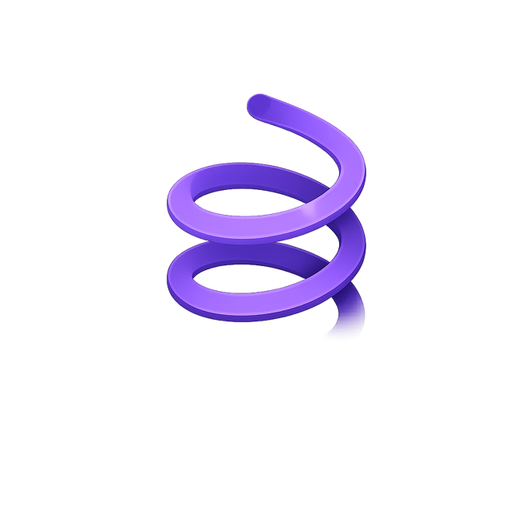

  

<h1 align="center">Uncoil</h1>

  Your entire development universe, finally connected. 
  A native macOS control center for Claude&nbsp;Code, Codex and Gemini&nbsp;CLI.

  
  
  
  
  

---

Agents are good at working in a terminal and bad at being many terminals. Uncoil
gives each agent a real PTY that survives the app closing, tells you which agent
is thinking and which one is waiting for you, and puts every project, session and
worktree in one window instead of fifteen tabs.

  

## Features

### Sessions that do not die

A separate daemon, `uncoil-runtimed`, owns the PTYs — not the app. Quit Uncoil,
crash it, update it: the agents keep working. A session you closed on purpose
resumes rather than restarts, so Claude Code comes back with `--resume` and its
history intact.

### Honest status

**Ready · Thinking · Running a tool · Waiting for permission · Waiting for a
reply** — read from Claude Code's own hooks, not guessed from terminal output.
The sidebar tells you at a glance which session needs you, and the Attention
Center collects everything that is blocked: permission prompts, finished turns,
failing tests, merge conflicts.

### Three agents, one window

Claude Code, Codex and Gemini CLI, each launched the way its own build
documents. Sub-agents nest under the session that started them, sleeping
sessions keep their place, and the colour on a row is the agent that owns it.

### Projects and worktrees

Git worktrees are first-class: create one with a session already inside it, see
what changed, merge it back without leaving the window. The project screen
collects the branch, the uncommitted files, recent commits, the open pull
requests — and turns the repository's own `TODO.md` into a task board with no
second database.

### Accounts

Each profile gets an isolated config directory (`CLAUDE_CONFIG_DIR`,
`CODEX_HOME` and the Gemini equivalent), so a work login and a personal one can
be signed in at the same time without fighting.

### An MCP control plane

Uncoil exposes a bounded, permissioned MCP surface to the agents it runs —
projects, sessions, artifacts, tasks, run, system, browser and computer. Child
sessions can only be created from named presets with capabilities intersected
against the caller, never escalated. See [`docs/current/mcp/`](docs/current/mcp/).

The browser and computer capabilities are driven by two open-source tools:
[agent-browser](https://github.com/vercel-labs/agent-browser) by Vercel Labs
for `uncoil_browser`, and [Cua](https://github.com/trycua/cua)'s `cua-driver`
for `uncoil_computer`. Both are optional, and neither is installed without
your explicit approval — Uncoil asks first, every time.

### And the window itself

A command palette that reaches everything, editable themes, notifications,
popout windows, split sessions, and a menu bar item that carries the count of
whatever is waiting for you.

## Install

Download the latest release from the
[Releases page](https://github.com/gkhntpbs/uncoil/releases/latest), unzip it,
and drag Uncoil to your Applications folder. The build is signed and notarized.

Requires macOS 14 or later on Apple silicon. There are two dependencies, both
fetched by SPM and both permissively licensed:
[SwiftTerm](https://github.com/migueldeicaza/SwiftTerm) (MIT) for the terminal
and [Sparkle](https://github.com/sparkle-project/Sparkle) (MIT) for updates.

## Layout

| Path                              | What lives there                                                                                                               |
| --------------------------------- | ------------------------------------------------------------------------------------------------------------------------------ |
| `App/`                            | The app. `Core/` models and stores, `Terminal/` the SwiftTerm host, `UI/` views, `UI/AppKit/` the `NSOutlineView`-backed lists |
| `RuntimeHelper/`                  | `uncoil-runtimed`, the daemon that owns the PTYs                                                                               |
| `McpHelper/`                      | `uncoil-mcp`, the bundled MCP stdio server                                                                                     |
| `HookHelper/`, `ExtensionHelper/` | The Claude Code hook bridge and the extension host                                                                             |
| `Shared/`                         | Wire protocols compiled into both the app and the helpers                                                                      |
| `docs/current/`                   | Product status, release process, MCP documentation                                                                             |

## Contributing

Issues and pull requests are welcome.

**AI tools are welcome here.** Much of Uncoil was built with coding agents —
the app is, after all, a control center for them. Use Claude Code, Codex,
Gemini CLI or whatever makes you productive; what matters is that you review
what you submit and that it holds up.

Run the test suite before opening a pull request.

## License

[Apache License 2.0](LICENSE). See [NOTICE](NOTICE) for third-party components.

  Developed by <a href="https://github.com/gkhntpbs">Gökhan Topbaş</a> · <a href="mailto:info@gokhantopbas.com">info@gokhantopbas.com</a>

